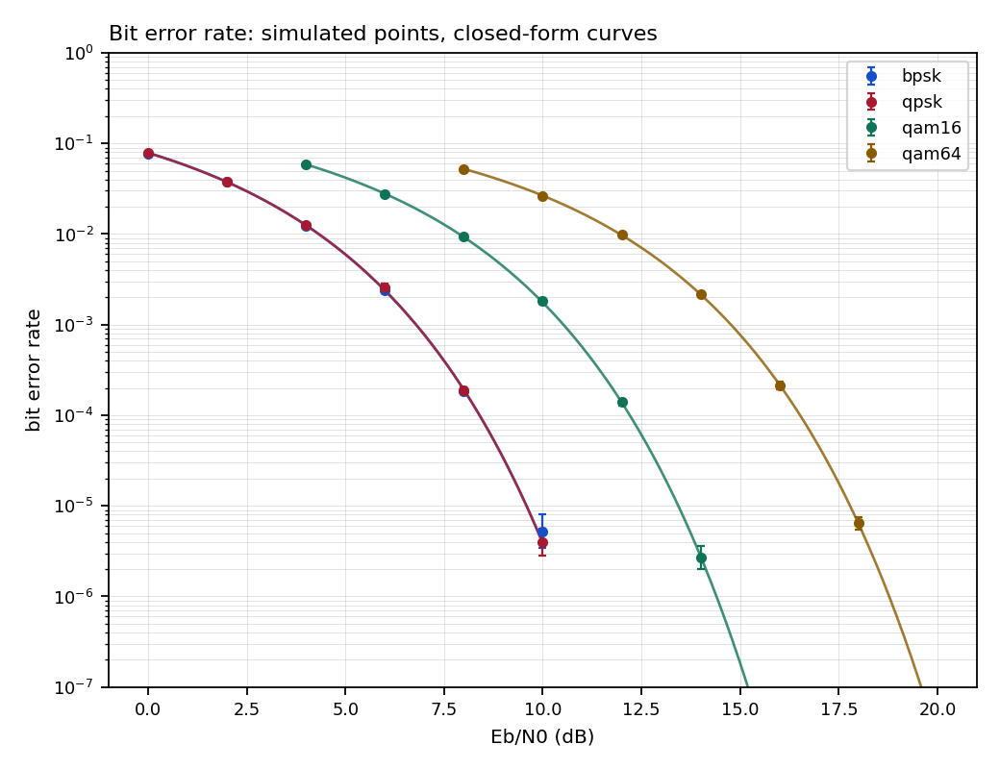
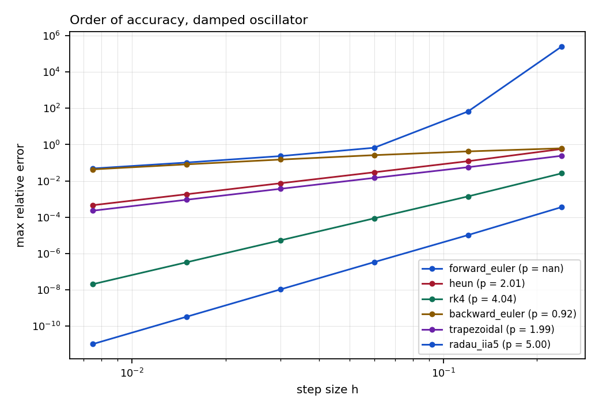
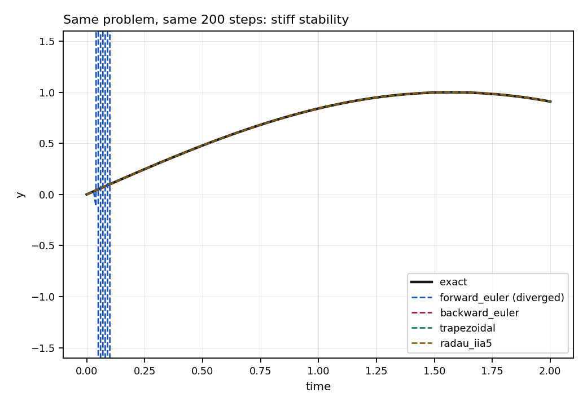
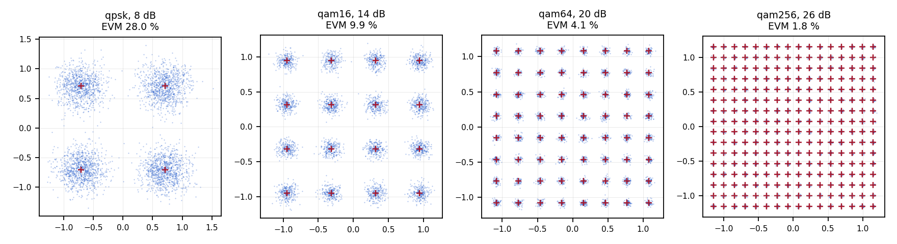

# physim

Numerical ODE solvers and physical-layer models, each scored against a
closed-form reference rather than against itself.

Two halves that share one idea. The first is a set of Runge-Kutta methods,
explicit and implicit, applied to problems whose exact solutions are known,
so every error figure is a comparison with an analytical answer rather than
with a finer grid. The second is a digital link simulator whose measured bit
error rates are checked against the closed-form expressions for the same
constellations. A browser dashboard runs both on demand.



## What it does

- **Nine solvers.** Forward Euler, Heun, RK4, Bogacki-Shampine 3(2),
  Dormand-Prince 5(4), backward Euler, trapezoidal, TR-BDF2 and a 3-stage
  Radau IIA of order 5. Adaptive methods use a PI step-size controller;
  implicit methods use a simplified Newton iteration with an LU factorisation
  reused across iterations.
- **Eleven test problems**, nine with analytical solutions, from exponential
  decay up to a 40-state RLGC transmission line whose reference comes from a
  matrix exponential. Stiff cases include Prothero-Robinson, Robertson
  kinetics and van der Pol at mu = 100.
- **Six constellations** (BPSK through 256-QAM) with Gray labelling, an exact
  QAM bit-error-rate reference derived from per-dimension PAM transition
  probabilities, AWGN / Rayleigh / Rician / Jakes channels, RRC pulse shaping,
  path loss and link budgets, and front-end impairments.
- **A validation harness** that runs all of it and writes a JSON record with
  the environment it ran in.
- **263 tests.** Butcher tableaux are checked against their order conditions,
  not against a transcription of the literature.

## Quick start

```bash
git clone https://github.com/yourname/physim && cd physim
pip install -e ".[api,dev,plots]"

pytest tests -q                 # 263 tests, about a minute
physim validate                 # full suite -> results/validation.json
physim serve                    # dashboard on http://127.0.0.1:8000
```

Without installing, `PYTHONPATH=src:. python3 -m physim.cli ...` works the
same way.

### Command line

```bash
physim list                                          # solvers, problems, schemes
physim solve --problem rlc_step --solver rk45        # integrate and score
physim converge --solvers heun,rk4,radau_iia5        # measure the order
physim ber --scheme qam16 --ebn0 4:16:2              # Monte Carlo against theory
physim link --distance 500 --scheme qam16            # link budget
physim bench --problem damped_oscillator             # work against precision
```

### Dashboard

Five views: BER against Eb/N0 with Wilson confidence intervals, solver
accuracy with a residual trace, order-of-accuracy refinement, the received
constellation with its EVM, and path loss with a live link budget. Every
curve is computed on request; nothing is a cached image. Plotting is
dependency-free canvas code, so there is no build step.

## Results

All numbers below come from `results/validation.json`, regenerated by
`make validate` on Python 3.12.3, NumPy 2.4.4, SciPy 1.17.1.

### Accuracy against closed forms

Thirty-two problem-method pairs, every one inside 0.01 % of its analytical
solution. The worst case is 0.0045 %.

| Problem | Method | Max relative error |
|---|---|---|
| stiff_linear | Radau IIA (order 5) | 0.0045 % |
| transmission_line (40 states) | TR-BDF2 | 3.4e-4 % |
| transmission_line | RK4 | 1.6e-4 % |
| damped_oscillator | TR-BDF2 | 7.9e-6 % |
| transmission_line | Radau IIA | 6.3e-6 % |
| harmonic_oscillator | RK4 | 3.3e-7 % |

The error metric is normalised by the amplitude of the reference rather than
pointwise, because a pointwise relative error is meaningless wherever an
oscillatory solution crosses zero.

### Order of accuracy

Fitting log(error) against log(h) recovers each method's theoretical order.
Points that have reached the round-off floor are excluded from the fit; if no
asymptotic range exists the study reports that instead of a slope.

| Method | Theory | Measured | Deviation |
|---|---|---|---|
| Forward Euler | 1 | 1.029 | 2.9 % |
| Backward Euler | 1 | 0.974 | 2.6 % |
| Heun | 2 | 2.050 | 2.5 % |
| Trapezoidal | 2 | 1.986 | 0.7 % |
| RK4 | 4 | 4.054 | 1.4 % |
| Radau IIA | 5 | 5.006 | 0.1 % |



### Stiffness

Prothero-Robinson with lambda = -1e4, every method given the same 200 steps,
so h|lambda| = 50 against an explicit stability limit of 2:

| Method | Result | Max relative error | LU factorisations |
|---|---|---|---|
| RK4 | diverged at t = 0.025 | — | 0 |
| Backward Euler | completed | 2.5e-5 % | 400 |
| Trapezoidal | completed | 4.0e-8 % | 400 |
| TR-BDF2 | completed | 2.0e-8 % | 498 |
| Radau IIA | completed | 1.4e-11 % | 400 |



Robertson kinetics, nine decades of timescale, integrated by TR-BDF2: total
mass is conserved to 3.6e-15, against an exact invariant.

### Bit error rate

Four constellations, 26 Eb/N0 points, 17.8 million bits:

| Scheme | Worst deviation from theory | Implementation loss |
|---|---|---|
| BPSK | 8.3 % | 0.012 dB |
| QPSK | 5.1 % | 0.011 dB |
| 16-QAM | 2.7 % | -0.004 dB |
| 64-QAM | 5.5 % | -0.014 dB |

Those percentages are sampling noise, not bias. A run that stops at 500 errors
has a standard error of 1/sqrt(500), about 4.5 %, so single-digit deviations
are what a correct simulator produces. The measure that matters is horizontal:
the implementation loss, the dB shift needed to lay the measured curve onto
the theoretical one, stays inside 0.015 dB everywhere.

Theory falls inside the 95 % Wilson interval at 24 of the 26 points. Both
misses are understood: 64-QAM at 14 dB reads 5.5 % low on 1221 errors, a
1.9-sigma fluctuation, and 64-QAM at 20 dB collected a single error where 0.1
was expected, which is an ordinary Poisson outcome that no interval built on
one count can absorb.



**The two error figures are not comparable.** The 0.01 % claim belongs to the
ODE solvers, where the reference is exact and the only error is
discretisation. Monte Carlo BER is limited by how many errors were counted,
and no amount of care takes it below a few percent without spending far more
samples.

## Reproducing everything

```bash
make validate       # results/validation.json
make experiments    # every figure plus results/experiments.json
```

Both are seeded. The same commit gives the same numbers, and the JSON record
carries the interpreter, NumPy and SciPy versions that produced them.

Cross-language checks live in `matlab/` and `julia/`: the same RK4 convergence
study and the same stiff comparison, written independently against each
language's own ODE facilities. They are not part of CI, which runs Python
only.

## Documentation

- [docs/THEORY.md](docs/THEORY.md) — the methods, tableaux, stability, and
  the closed-form BER derivations
- [docs/VALIDATION.md](docs/VALIDATION.md) — what is measured, how, and what
  each number is allowed to mean
- [docs/ARCHITECTURE.md](docs/ARCHITECTURE.md) — layout, HTTP contract,
  extension points

## Layout

```
src/physim/
  core/          Jacobians, Newton, LU, error norms
  solvers/       explicit and implicit Runge-Kutta, drivers
  problems/      the benchmark library and its analytical solutions
  validation/    metrics, convergence studies, the report harness
  phy/           modulation, channel, theory, link, pulse, impairments
  experiments/   figure and results generation
  cli.py
api/             FastAPI app and the dashboard it serves
tests/           263 tests
matlab/ julia/   cross-language checks
```

## Licence

MIT.
